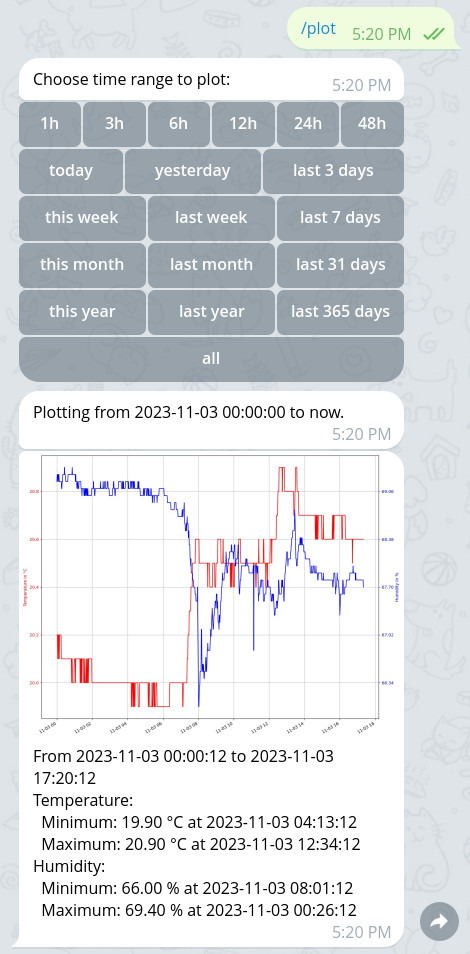

# piDhtBot
Temperature and humidity logger based on a DHT22 on a Raspberry Pi and Telegram, controllable via smartphone and computer. Logged data can be plotted to a graph.

## Description
This is a simple Telegram bot that acts as a temperature and humidity logger. It is intented to run on a Raspberry Pi but may be used on any other Linux system, too. It requires a DHT11, DHT22 or AM2302 sensor. It can be controlled by any Telegram client, thus supporting many different client platforms such as smartphones (Android, iOS and Windows Phone) and computers (Linux, macOS and Windows).

Recorded temperature and humidity data can be plotted to a graph using matplotlib. The user can choose a time range to plot.

## Requirements
- Raspberry Pi with [Raspberry Pi OS](https://www.raspberrypi.org/software/) (recommended, but works on any other Linux system with some adjustments)
- Temperature and humidity sensor (DHT11, DHT22 or AM2302)
- [Telegram](https://telegram.org/) account and a [Telegram bot](https://core.telegram.org/bots)
- python (version 3):
  - [python-telegram-bot](https://github.com/python-telegram-bot/python-telegram-bot)
  - [Adafruit CircuitPython DHT](https://github.com/adafruit/Adafruit_CircuitPython_DHT)
    - Requiring also the following packages: libgpiod2
  - [Matplotlib](https://matplotlib.org/)
    - Requiring also the following packages: libtiff5 libopenjp2-7-dev libatlas3-base

To install the necessary software on Raspberry Pi OS, Debian or a similar distribution use the following commands:
- as root:
  - `apt install libgpiod2 libtiff5 libopenjp2-7-dev libatlas3-base`
  - `apt install python3-pip`
- as regular user:
  - `pip3 install python-telegram-bot==13.14 adafruit-circuitpython-dht matplotlib`
  
## Configuration
Copy `config.json.example` to `config.json` and open it for editing. In section `telegram` enter your Telegram `token` and `owner_ids`. See these [instructions for obtaining your Telegram user ID](https://stackoverflow.com/questions/31078710/how-to-obtain-telegram-chat-id-for-a-specific-user). Alternatively just add your Telegram token and a random owner ID, run piDhtBot and send a message to your bot. piDhtBot will log messages from unknown users and write out their user IDs.

For the DHT sensor set a correct `dht`:`type` in `config.json` and `gpio` port in `config.py`. You can use `python test_dht.py` to check if the DHT sensor is working and a correct gpio port has been configured. Note that errors during reading are expected from this test script.

There are various further configuration options available. For example the data logging interval and the size and DPI of the plotted images.

### Optional: Use a tmpfs for plotted images
Especially when using a Raspberry Pi it is a good idea to write plotted images to a tmpfs. This increases the lifespan if your sdcard. Using the standard configuration piDhtBot writes its plotted images to `/tmp/piDhtBot.png`. To mount `/tmp/` as tmpfs add the following line to your `/etc/fstab`:
```
tmpfs           /tmp            tmpfs   nosuid,size=25%   0       0
```
After a reboot `/tmp/` should be mounted as tmpfs.

## Starting the bot
Execute `python3 piDhtBot.py` as a regular user. The bot will automatically send a greeting message to all owners if Telegram access is working. For troubleshooting take a look at its log files inside the piDhtBot directory. It is recommended to start the bot automatically after boot, e.g. via a crontab entry or init script.

### Autostart
It is recommended to start the bot automatically after boot, e.g. via a crontab entry or init script. Here is an example for starting the bot automatically at boot inside a tmux session, via cron (`crontab -e` as a regular user, i.e. non-root):
```
@reboot              cd ~/pidhtbot && SHELL=/bin/bash tmux new -d -s pidhtbot "python3 piDhtBot.py"
```
You can attach to it via `tmux a -t pidhtbot` and detach from it via the default key binding `ctrl-b d`.

There is also a shell script which automatically restarts the bot on fatal errors: `piDhtBotLoop.sh`. To use it, just run this shell script instead of the python script. You can also add it to cron, of course (as an alternative to the previous example, don't add both!):
```
@reboot              cd ~/piDhtBot && SHELL=/bin/bash tmux new -d -s pidhtbot "./piDhtBotLoop.sh"
```

## Controlling the bot
The bot will automatically start with data recording.

You can use `/help` to list the available commands:
- `/show`: Show last read data.
- `/plot`: Plot recorded data.
- `/log`: Show recent log messages.
- `/help`: Show a list of supported commands.

The `/plot` command will offer a list of time ranges to plot to the user.

# Examples

## Example conversation with the Telegram bot


# License
[GPL v3](http://www.gnu.org/licenses/gpl.html)
(c) [Alexander Heinlein](http://choerbaert.org)
